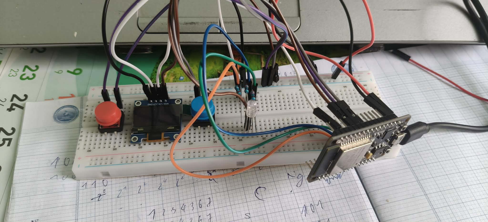
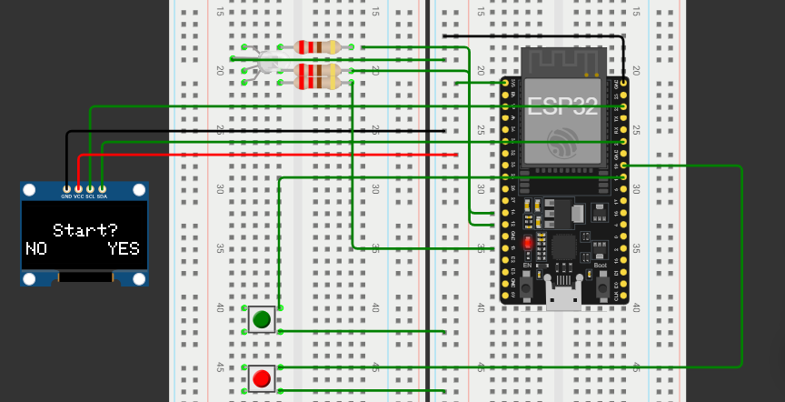

✨✨✨This is my second project with ESP32.
### 🌈 ESP32 RGB LED Controller
### 🚀 Project Overview
Comming soon

### 🎥 Demo
👉Watch demo here: https://youtu.be/klJtI-NdMPE😘

## 🖼️ Project Illustration 
- 
- 

## 🧠 Features

- Control RGB LED colors
- PWM signal generation
- ESP32 WiFi integration
- Real-time LED control

## 🛠️ Hardware Used

- ESP32 DevKit V1
- RGB LED Anode
- Resistors
- Breadboard
- Jumper wires
- OLED 0.96 inch
- Buttons

## 💻 Software Used
- Blynk

## 🔌 Wiring Diagram

| Component | ESP32 Pin |
|----------|------------|
| Red      | GPIO 14    |
| Green    | GPIO 12    |
| Blue     | GPIO 13    |
| Button 1 | GPIO 18    |
| Button 2 | GPIO 19    |
| OLED SDA | GPIO 21    |
| OLED SCL | GPIO 22    |

## 👨‍💻 Author

Tuấn Kiệt Nguyễn

