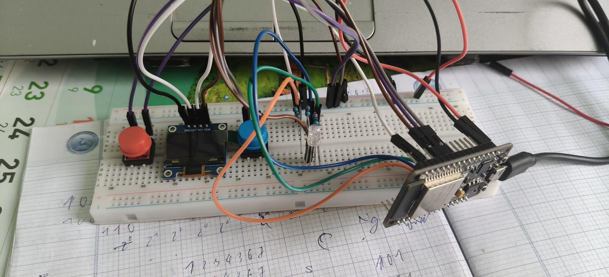
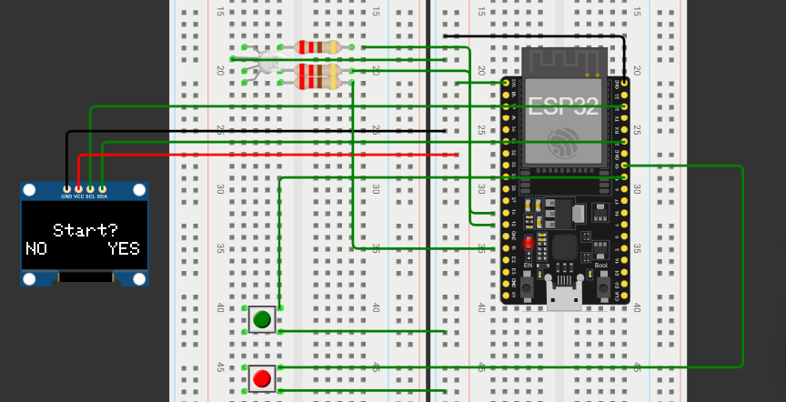

✨✨✨This is my second project with ESP32.
### 🌈 ESP32 RGB LED Controller
### 🚀 Project Overview
- OLED show 2 options to start program
- Design sliders on Blynk app 
- Using Blynk to control brightness of 3 basic colors (Red, Green, Blue) to display billions of colors.

### 🎥 Demo
👉Watch demo here: https://youtu.be/klJtI-NdMPE😘

## 🖼️ Project Illustrations
- 
- 

## 🧠 Features

- Control RGB LED colors
- PWM signal generation
- ESP32 WiFi integration
- Real-time LED control

## 🛠️ Hardware Used

|    Hardware    |  Quantity  |
|----------------|------------|
|ESP32 DevKit V1 |      1     |
|RGB LED Anode   |      1     |
|Resistors       |      3     |
|Breadboard      |      1     |
|Jumper wires    |      17    |
|OLED 0.96 inch  |      1     |
|Buttons         |      2     |

## 💻 Software Used
- Blynk mobile
- Blynk web

## 🔌 Wiring Diagram

| Component | ESP32 Pin |
|----------|------------|
| Red      | GPIO 14    |
| Green    | GPIO 12    |
| Blue     | GPIO 13    |
| Button 1 | GPIO 18    |
| Button 2 | GPIO 19    |
| OLED SDA | GPIO 21    |
| OLED SCL | GPIO 22    |

## 👨‍💻 Author

Tuấn Kiệt Nguyễn

Connect to me: nguyentuankiet070507@gmail.com

